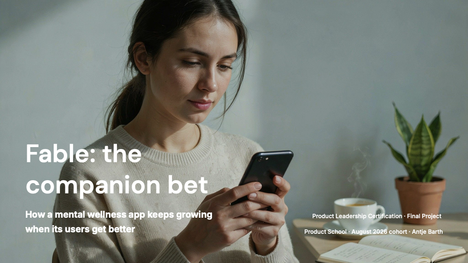

# Fable: the companion bet

> Product Leadership certification, final project. The **Fable Growth** scenario (B2C, retention and engagement), taken from diagnosis to a funded business case with kill criteria across six in-class labs.
>
> Antje Barth · Product Leadership · Aug 2026 cohort

---

[](05-insights/product-leadership-final-antje-barth.pdf)

_The full six-slide deck: [product-leadership-final-antje-barth.pdf](05-insights/product-leadership-final-antje-barth.pdf)_

## The problem

Fable is a mental health app. People download it when they're struggling with anxiety, it helps them, and after about three or four months they feel better and stop using it. That's the problem. The app works, and then people leave. It grew to 4.2M users this way, with the acute need resolving in 90 to 120 days.

So Fable isn't really competing with Calm or Headspace. It's competing with people deciding they don't need an app anymore. You can't fix that with engagement mechanics, because the mechanics would be arguing with a user who is right.

## The bet

Change what Fable is. Right now it's something you use to get through a rough patch. We want it to be something you keep, because it remembers you: your history, what you've been through, what helped last time. The longer you use it, the more useful it gets, which is the opposite of how it works today.

**The hard no that gives it teeth.** We are deliberately not adding streaks, reminders, or anything designed to make people feel like they have to open the app. That stuff works, and lots of apps do it, but it would make Fable feel manipulative. People trusting us at their worst moments is the whole reason this works at all. We measure "felt understood," never "couldn't leave."

That refusal costs real revenue, and it is what the rest of this repo is organised around defending.

## What we're building, and what it costs

Three things this quarter: check-ins that use what we already know about you, a way to help when someone's in crisis, and making the app open faster, because if someone reaches for it at 3am and it takes four seconds to load, that's a bad moment to be slow.

On the money side, Fable roughly breaks even on each subscriber once you account for the cost of getting them. So this isn't about growth. It's about fixing something that isn't quite working. And we wrote down in advance what result would tell us to stop.

## The argument in one pass

Each deliverable answers the question the previous one opens.

| | Deliverable | The question it answers | Module |
|---|---|---|---|
| 1 | [Product Strategy & OKRs](01-strategy/strategy-and-okrs.md) | What are we becoming, and what will we refuse? | M1 |
| 2 | [Outcome Roadmap & Trade-off Memo](02-roadmap/outcome-roadmap.md) | What ships first, and what did we cut to mean it? | M2 |
| 3 | [Team Charter](03-team-charter/team-charter.md) | Who decides, and what happens when the hard no meets a retention target? | M3 |
| 4 | [Financial Model](04-financial-model/financial-model.md) | Does the bet survive finance, and what number ends it? | M5 |
| 5 | [Individual Insights](05-insights/individual-insights.md) | What did building this actually teach me? | M6 |
| ★ | [Final presentation](05-insights/product-leadership-final-antje-barth.pdf) | The whole argument in six slides | M6 |

Module 4 (Drive Alignment and Executive Influence) shaped how these land with executives rather than producing a separate artifact.

**The through-line.** The strategy sets one hard no. The roadmap cuts daily streaks, the content library, social sharing and the B2B tier to honour that no. It then treats a sub-2-second load time as a Rock, because a slow open undermines a product whose promise is being "the first thing you talk to." The charter turns the hard no into a standing veto that anyone on the team can invoke. The financial model prices what the no costs and names the number that would end the bet.

## Load-bearing assumptions

Two numbers carry this case, and both are named on the page rather than buried in it. Each has a kill criterion with a date and a threshold against it.

**The churn tail.** How long people stay once they get past six months. It supplies most of the value in the model, and nobody has measured it. Gated at month 12.

**The link between feeling understood and staying.** We assume one point of "felt understood" buys 0.67 points of retention, but that comes from dividing one OKR by another, not from observation. So the gate that matters reads the retention outcome directly, rather than trusting the sentiment score that is supposed to predict it.

The ask is to judge this bet on how much room it buys above breakeven, which is $3.17 a month, rather than on a 3:1 ratio the mechanism cannot reach at any realistic retention. Detail in [the financial model](04-financial-model/financial-model.md).

## Repo structure

```
product-school-product-leadership/
├── README.md
├── 01-strategy/
│   └── strategy-and-okrs.md      Playing to Win, the hard no, OKR cascade
├── 02-roadmap/
│   └── outcome-roadmap.md        Now/Next/Later, trade-off memo, backlog scoring
├── 03-team-charter/
│   └── team-charter.md           What We Own, How We Decide
├── 04-financial-model/
│   └── financial-model.md        Business case, seven kill criteria
└── 05-insights/
    ├── individual-insights.md    Friction, learnings, aha
    └── product-leadership-final-antje-barth.pdf   The deck
```

## Status

| Deliverable | State |
|---|---|
| 1. Product Strategy & OKRs | Complete |
| 2. Outcome Roadmap & Trade-off Memo | Complete |
| 3. Team Charter | Complete |
| 4. Financial Model | Complete |
| 5. Individual Insights | Complete |
| Final presentation | Complete |
